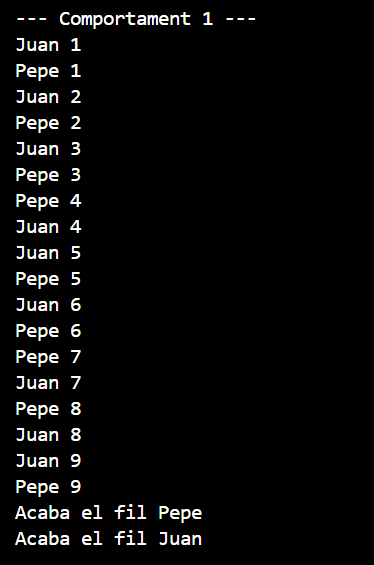
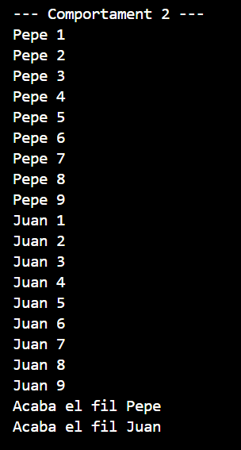
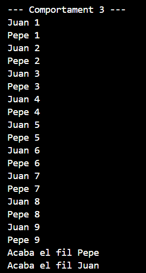

# Comportament 1

En aquest comportament es pot veure com es van intercalant Pepe y Juan de manera aleatoria.

# Comportament 2

En aquest comportament es pot veure com primer ho fa tot Pepe, després Juan i després acaben.

# Comportament 3

En aquest comportament es pot veure com es van intercalant de manera simétrica Juan i Pepe.
